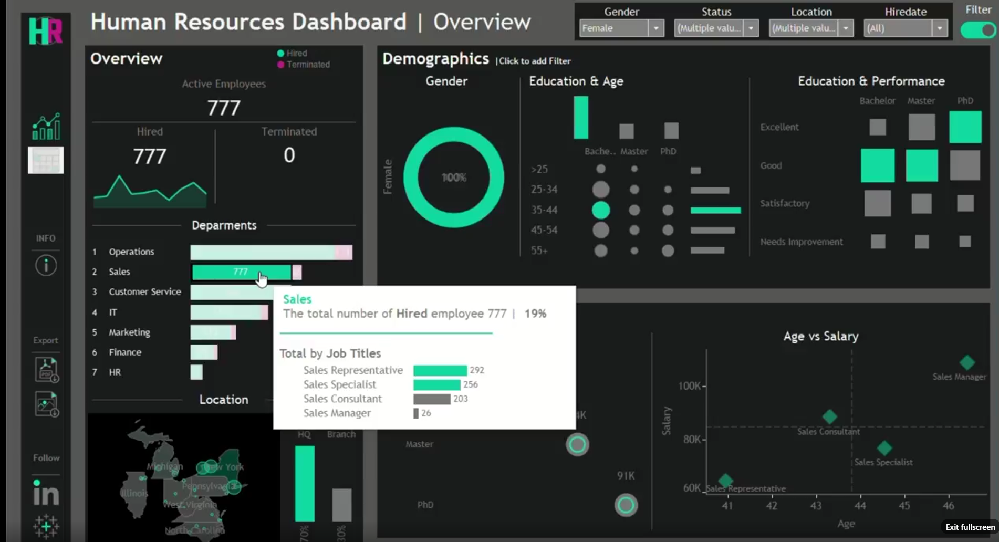

# 📊 HR Analytics Dashboard (Tableau)

A data-driven **HR Analytics Dashboard** built using **Tableau** to analyze employee trends, attrition, and workforce performance.

> 🚀 Designed for data-driven decision-making in HR.

---
## 🌐 Live Dashboard (Tableau Public)

👉 **View Interactive Dashboard:**  
🔗 [Click here to explore the dashboard](https://public.tableau.com/app/profile/tanmay.khedekar/viz/HRDashboard_17394575535210/HRSummary)

> 📌 Fully interactive — use filters, hover insights, and explore trends in real time.

## 📸 Dashboard Preview

> ⚠️ Upload your screenshot first (recommended name: `dashboard.png`)

<p align="center">
  
</p>

---

## 📌 Project Overview

This project focuses on analyzing HR data to extract meaningful insights such as employee attrition, salary trends, and department distribution.

The dashboard helps HR teams:
- Monitor employee trends 📈  
- Analyze attrition patterns 🔍  
- Improve retention strategies 💡  
- Make informed business decisions 🧠  

---

## ✨ Key Features

- 📉 Employee Attrition & Retention Analysis  
- 🏢 Department-wise Headcount  
- 💰 Salary Trends & Tenure Analysis  
- 🌍 Diversity & Performance Metrics  
- 📊 Interactive Dashboard Filters  
- ⚡ Clean & intuitive UI  

---

## 🧠 Tech Stack

| Category        | Tool |
|----------------|------|
| Visualization  | Tableau |
| Data Source    | CSV Dataset |
| File Type      | `.twbx` (Tableau Packaged Workbook) |

---

## 📂 Project Structure

```
HR-Analytics-Dashboard/
│
├── HR Dashboard.twbx
├── HumanResources.csv
└── README.md
```

---

## 🔍 Insights Generated

- Identified departments with highest attrition  
- Analyzed salary vs experience trends  
- Evaluated employee performance metrics  
- Explored workforce distribution  
- Highlighted diversity insights  

---

## 🎯 Business Impact

- Improves HR decision-making  
- Helps reduce employee attrition  
- Supports workforce planning  
- Enhances performance tracking  

---

## 🚀 How to Use

1. Download the `.twbx` file  
2. Open in Tableau Desktop / Tableau Public  
3. Explore the dashboard using filters  

---

## 📊 Key Metrics

- Attrition Rate  
- Employee Count  
- Salary Distribution  
- Tenure Analysis  
- Department Performance  

---

## 👨‍💻 Author

**Tanmay Khedekar**  
🔗 https://github.com/tanmay302  

---

## 💡 Repository Description (Use on GitHub)

HR Analytics Dashboard built using Tableau to analyze employee attrition, salary trends, and workforce performance.
